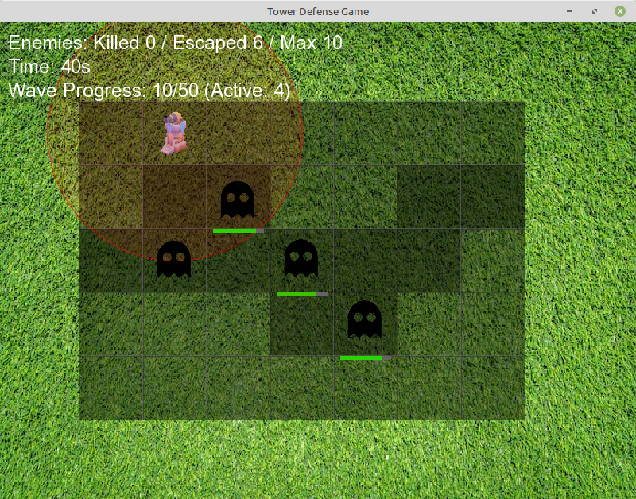

Tower Defense (SFML)

Simple tower defense prototype built as a first year uni project to learn C++, basic game architecture, and SFML.
doesn't really represent my current coding style or best practices, but I keep it here for nostalgia.

### Screenshot



### Build

From the project root:

```bash
g++ -std=c++17 -Iinclude -Isrc src/main.cpp src/Game.cpp -lsfml-graphics -lsfml-window -lsfml-system -o towerDefense
```

### Run

```bash
./towerDefense
```

Terminal will block until you input number of towers and tower coordinates
